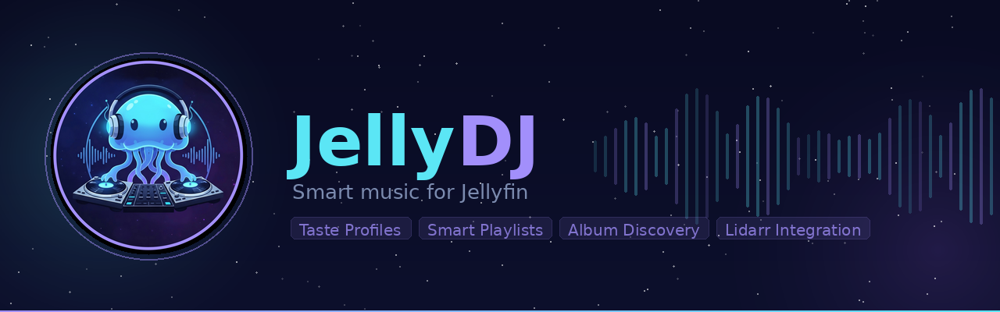
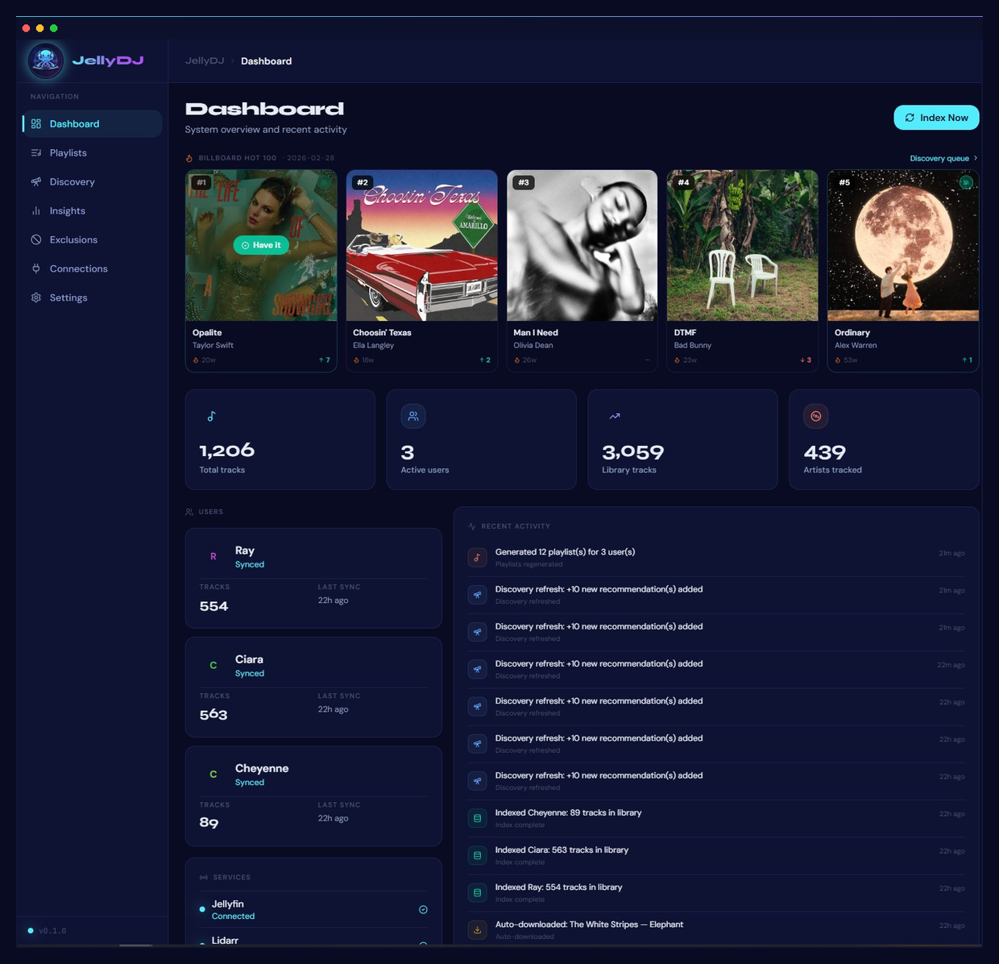
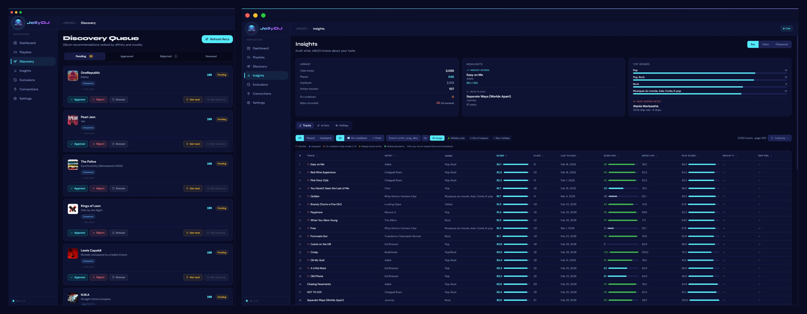
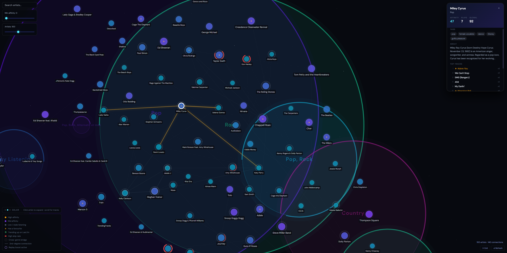
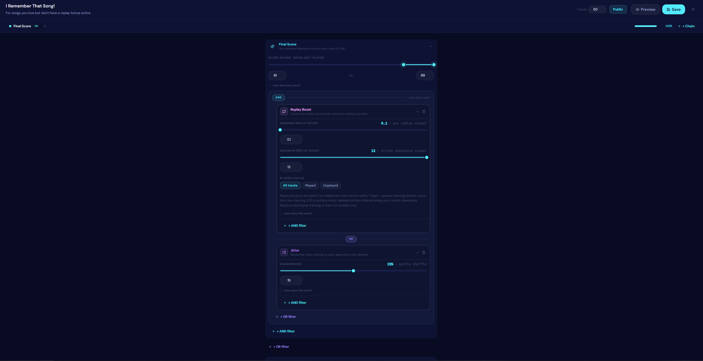
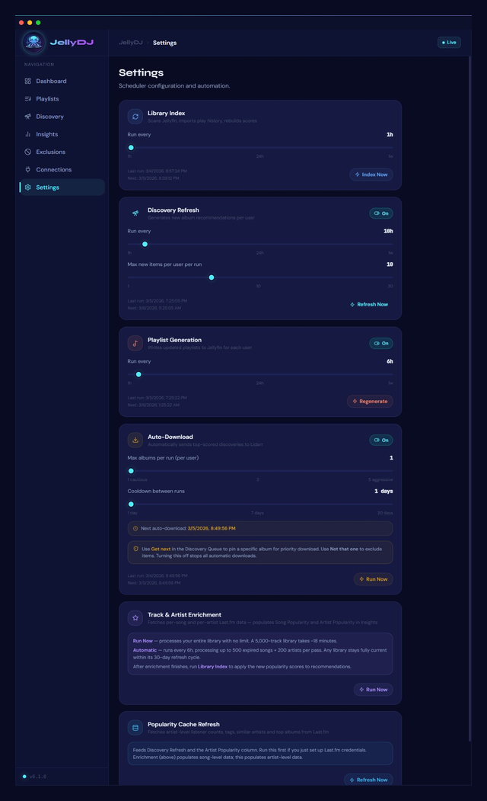
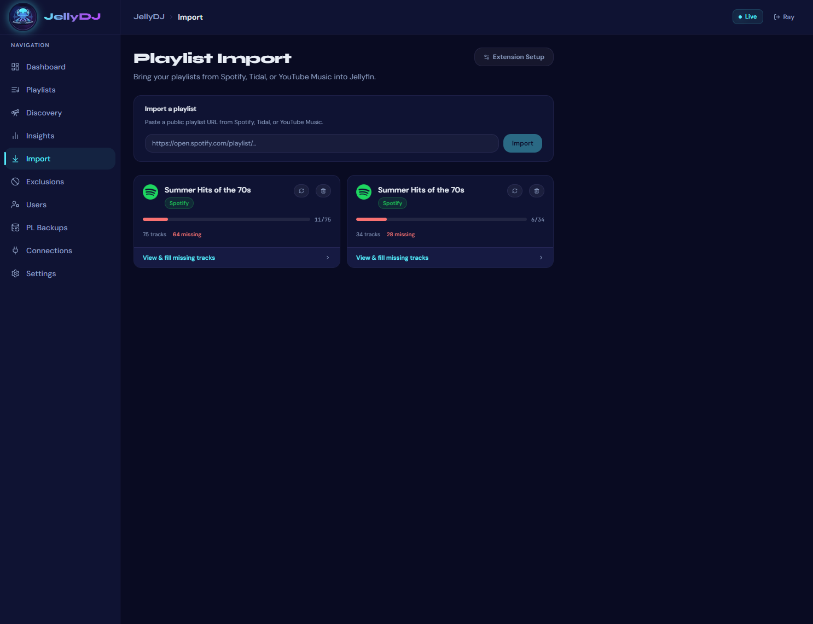
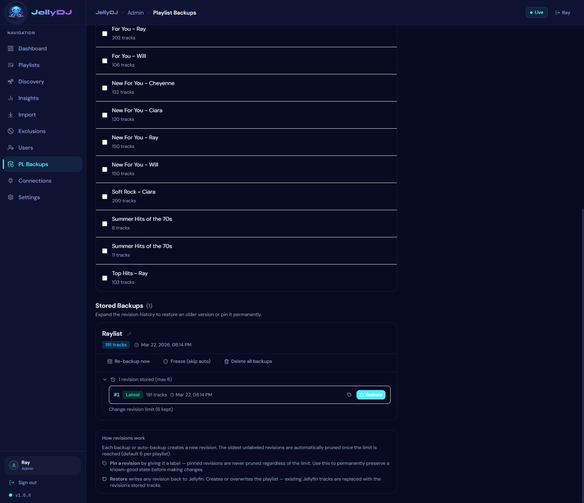
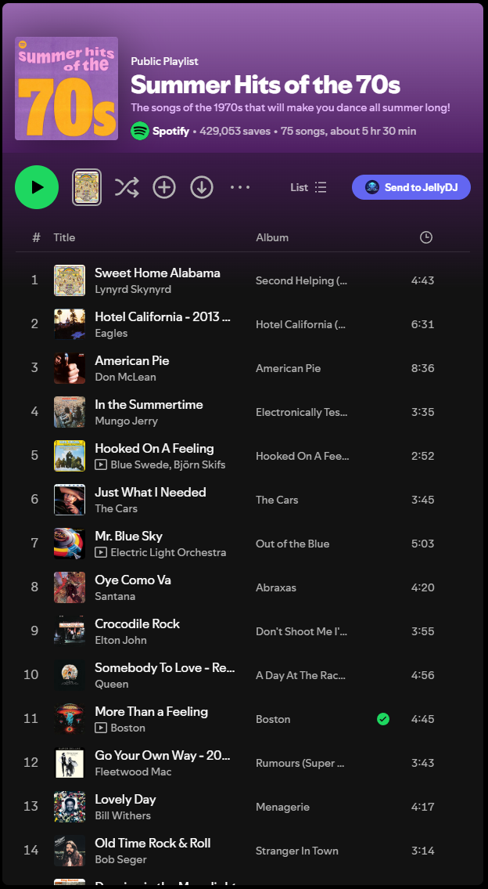
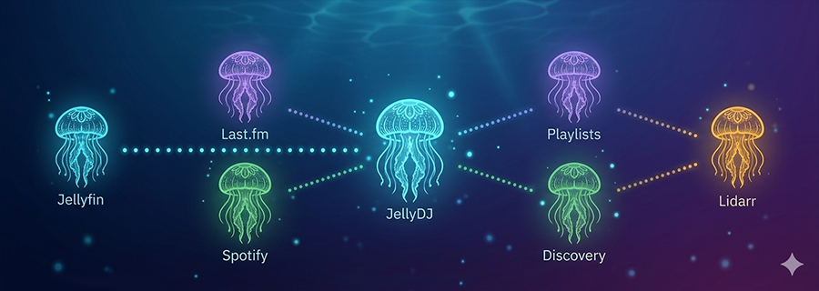

<p align="center">
  
</p>

<p align="center">
  <a href="https://github.com/TehRainMan17/JellyDJ/releases/tag/v1.2.0"></a>
  <a href="https://github.com/TehRainMan17/JellyDJ/stargazers"></a>
  <a href="https://github.com/TehRainMan17/JellyDJ/network/members"></a>
  <a href="https://github.com/TehRainMan17/JellyDJ/issues"></a>
  <a href="https://github.com/TehRainMan17/JellyDJ/blob/main/LICENSE"></a>
  <a href="https://hub.docker.com/r/562ray/jellydj-backend"></a>
  <a href="https://discord.gg/HdKaQSAaGa"></a>
</p>

<p align="center">
  <strong>A self-hosted music recommendation engine that turns your static Jellyfin library into a living, breathing music ecosystem.</strong><br/>
  Taste profiles &nbsp;·&nbsp; Smart playlists &nbsp;·&nbsp; Custom playlist editor &nbsp;·&nbsp; Album discovery &nbsp;·&nbsp; Music Universe Map &nbsp;·&nbsp; Lidarr integration &nbsp;·&nbsp; Playlist import &nbsp;·&nbsp; Playlist backups
</p>

<br/>

---

## 🚀 Quick Start

**Prerequisites:** Docker + Docker Compose, a running [Jellyfin](https://jellyfin.org) instance, and *(optionally)* [Lidarr](https://lidarr.audio) for auto-download.

### 1. Create your compose file

Create a `docker-compose.yml` anywhere on your server:

```yaml
version: "3.9"

services:
  backend:
    image: 562ray/jellydj-backend:latest
    restart: unless-stopped
    env_file: .env
    environment:
      - DATABASE_URL=sqlite:////config/jellydj.db
      - TZ=${TZ:-UTC}
    volumes:
      - jellydj-config:/config
    networks:
      - jellydj

  frontend:
    image: 562ray/jellydj-frontend:latest
    restart: unless-stopped
    ports:
      - "${JELLYDJ_PORT:-7879}:3000"
    depends_on:
      - backend
    networks:
      - jellydj

volumes:
  jellydj-config:

networks:
  jellydj:
```

### 2. Create your `.env` file

```env
JELLYDJ_PORT=7879
TZ=America/New_York
SECRET_KEY=your_generated_key_here

# First-time setup account (remove after Jellyfin is connected — see step 5)
SETUP_USERNAME=admin
SETUP_PASSWORD=your_strong_setup_password_here
```

Generate strong values for `SECRET_KEY` and `SETUP_PASSWORD`:

```bash
python -c "import secrets; print(secrets.token_hex(32))"   # for SECRET_KEY
python -c "import secrets; print(secrets.token_urlsafe(24))"  # for SETUP_PASSWORD
```

> ⚠️ Set `SECRET_KEY` once and don't change it — it encrypts your stored API keys. Changing it later will require re-entering all credentials.

### 3. Launch

```bash
docker compose up -d
```

### 4. Open

```
http://localhost:7879
```

### 5. First-time setup

JellyDJ requires a Jellyfin connection to log in — but you need to log in to configure the Jellyfin connection. The **setup account** breaks this chicken-and-egg problem.

1. On the login page, click **"First time setup? Use setup account"** at the bottom.
2. Sign in with the `SETUP_USERNAME` and `SETUP_PASSWORD` you set in your `.env`.
3. Go to the **Connections** page and enter your Jellyfin URL and API key.
4. Once connected, log out and sign back in with your **Jellyfin** credentials.
5. **Remove `SETUP_USERNAME` and `SETUP_PASSWORD` from your `.env`** and restart:

```bash
docker compose up -d
```

The setup login is automatically disabled once you remove those variables. It is also automatically blocked once Jellyfin is configured, so leaving them in is safe for a brief setup window — but removing them is best practice, especially for internet-facing installs.

> 🔒 **Security note:** The setup account uses `SETUP_PASSWORD` from your `.env` — never the password of any Jellyfin user. Use a strong, randomly generated value and remove it as soon as setup is complete. The setup login endpoint is protected against timing attacks and is automatically rejected once Jellyfin is configured.

Hit **Index Now** on the Settings page after connecting Jellyfin to run your first library scan.

---

## 🪼 Why I Built This

My family moved off Spotify to take back control of our music. No subscriptions, no algorithms selling our data, no content disappearing overnight — just our library, our way.

But my girls missed something real: **the magic of discovery**. That moment when a service just *knows* you well enough to surface an artist you've never heard but somehow immediately love. Spotify and YouTube Music are genuinely great at this, and plain Jellyfin has no answer for it.

So I built JellyDJ to fill that void — with some help from AI along the way.

It watches what everyone in the house listens to, builds taste profiles per person, and quietly surfaces new artists and albums they're likely to love — sending approved ones straight to Lidarr for download. My kid wakes up and there's new music in her library that she didn't have to search for. My wife's playlists update themselves. Nobody has to touch a thing.

**JellyDJ is what Jellyfin's music experience should have been all along.**

<br/>

---

## ❗ Disclaimer
I am not a professional programmer and this is not a professionally created piece of enterprise software.  I'm just a single dude making a thing he wanted.  I don't claim to make a production quality piece of software.  I'm using this project as much as a learning tool for software development and AI assisted code generation as I am genuinely creating a piece of desirable software.  There will be updates that break deployments or features.  I will debug in production.
This is early days on this project and, as such, large portions are unfinished, buggy, or plain missing.  

<br/>

---

## ✨ Features

| | Feature | Description |
|---|---|---|
| 🧠 | **Per-User Taste Profiles** | Affinity scores built from play counts, recency, skips, favorites, and replay signals — per person |
| 📋 | **Smart Playlists** | *For You*, *New For You*, *Most Played*, *Recently Played* — auto-generated directly in Jellyfin |
| 🎛️ | **Playlist Customization** | Full block-based playlist editor — mix and chain scoring signals with fine-grained controls |
| 🔭 | **Discovery Queue** | New artist and album recommendations ranked by affinity + novelty, ready to approve or reject |
| 📥 | **Auto-Download** | Approved discoveries go straight to Lidarr — your library grows while you sleep |
| 🔥 | **Billboard Hot 100** | Weekly chart data cross-referenced with your library so you never miss a trending track |
| 📡 | **Webhook Scoring** | Jellyfin playback events update taste profiles in real time — skips count against bad recs |
| 📊 | **Insights** | Full score breakdowns, genre affinities, top artists, skip analysis, and listening stats per user |
| 🌌 | **Music Universe Map** | Interactive zoom-driven graph of your taste — genres, artists, connections, skip signals, drift, and track orbits |
| 🎸 | **Multi-Source Enrichment** | Spotify, Last.fm, MusicBrainz, Billboard — layered signals, no single point of failure |
| 📥 | **Playlist Import** | Import any Spotify, Tidal, or YouTube Music playlist — JellyDJ matches tracks to your library and flags missing ones for Lidarr |
| 💾 | **Playlist Backups** | Rolling revision history for every JellyDJ playlist — browse, diff, and restore any prior version with one click |
| 🧩 | **Browser Extension** | Clip a Spotify or YouTube Music playlist URL directly from your browser and send it to JellyDJ for import |
| ⏱️ | **Artist Timeouts** | Skip 5+ songs from the same artist in 2 days and they're benched for a week — escalating to 14d and 30d on repeat offences |
| 🏠 | **Truly Self-Hosted** | No cloud, no accounts, no tracking. Your data stays on your hardware |

---

## 📸 Screenshots

### Dashboard
*Billboard Hot 100, system stats, per-user sync status, and live activity feed*

<p align="center">
  
</p>

### Discovery Queue &amp; Insights
*Review album recommendations with one tap &nbsp;·&nbsp; Deep dive into your taste profile with full score breakdowns*

<p align="center">
  
</p>

### Music Universe Map
*Your entire music taste visualised as an interactive galaxy — zoom from genre clusters down to individual tracks*

<p align="center">
  
</p>

### Playlist Customization
*Build any playlist you can imagine — chain scoring blocks with AND/OR logic, tune sliders, and let it rip*

<p align="center">
  
</p>

### Automation Settings
*Control every scheduler interval, enable auto-download, and tune enrichment — all from the UI*

<p align="center">
  
</p>

### Playlist Import
*Paste a Spotify, Tidal, or YouTube Music playlist URL — JellyDJ matches tracks to your library and surfaces missing ones*

<p align="center">
  
</p>

### Playlist Backups
*Every playlist change is versioned — browse the full revision history and restore any prior snapshot*

<p align="center">
  
</p>

### Browser Extension
*Clip a playlist URL from Spotify or YouTube Music and send it straight to JellyDJ for import*

<p align="center">
  
</p>

---

## 🌌 Music Universe Map

The Universe Map is an interactive force-directed graph of your personal music taste, accessible from **Insights → Universe**. It visualises everything JellyDJ knows about your listening in a single zoomable canvas.

### Three zoom levels

| Zoom | View | What you see |
|---|---|---|
| Zoomed out | **Galaxy** | Genre bubbles sized and colored by your affinity — brighter = more listened |
| Mid | **Solar** | Artists emerge inside their genre cluster, sized by plays + affinity |
| Zoomed in | **Star** | Click any artist to see their top tracks orbiting as moons |

### What the visuals mean

| Signal | Visual |
|---|---|
| **Node color** | Affinity heat: grey-blue (low) → teal → purple → gold (high). Stale artists (180+ days unplayed) cool toward grey. Fresh + trending artists glow warmer. |
| **Node size** | Blends affinity score and raw play count |
| **↑ / ↓ arrow** | Artist trending up or down on Last.fm (requires enrichment) |
| **Red arc** | Skip rate — sweeps around the node, longer = higher skip percentage |
| **Dashed white ring** | Cross-genre bridge — this artist has similarity connections into another genre |
| **Purple ring** | Replay boost active — you've been deliberately returning to this artist |
| **★** | You have a favourite track by this artist |

### Interactions

- **Click an artist** — highlights direct connections in gold, second-degree connections in silver, dims everything else. The artist node shrinks to an anchor dot; top tracks orbit around it as moons.
- **Click a track moon** — opens a track detail card showing play count, recommendation score, skip penalty, and cooldown status.
- **Hover an artist** — previews connections at lower intensity without committing to a selection.
- **Search box** — highlights matching artists across the whole graph.
- **Sliders** — filter by minimum affinity or cap artist count without resetting your zoom position.
- **⛶ Full** — expands to a true fullscreen overlay. **Esc** or **✕ Exit** to return.

### Track moons (zoomed in, artist selected)

Each moon represents one of the artist's top tracks. A red arc around the moon indicates skip penalty for that specific track. A `↺` sparkle means replay boost is active. Favourite tracks glow gold.

---

## 🎛️ Playlist Customization

JellyDJ's playlist editor lets you build entirely custom playlists using a block-based scoring system. Every playlist is a chain of **filter blocks** connected by AND/OR logic — combine as many signals as you want and the engine handles the rest.

### How It Works

Each playlist is built from one or more **OR groups**, each containing one or more **AND filter blocks**. A track must satisfy all AND conditions within at least one OR group to be included.

### Available Filter Blocks

| Block | What It Does |
|---|---|
| **Final Score** | Filter by your personal blended score for every track (0–99). Use a high minimum (e.g. 81–99) to get only your most loved songs. |
| **Replay Boost** | Surface tracks you've been deliberately seeking out. Set a low minimum (e.g. 0.1) for any replay signal, or a high maximum (e.g. 2.0) to exclude current obsessions. |
| **Jitter** | Randomize track ordering so every playlist generation feels different. 15% = gentle shuffle; higher values = more chaos. |

### Replay Boost Explained

Replay boost is calculated from deliberate artist volume within 7 days — passive listening doesn't count. This makes it a strong signal for "I keep going back to this" vs. "this came up on shuffle."

- **Low min (e.g. 0.1):** surface mildly-replayed artists
- **High max (e.g. 2.0):** exclude your current obsessions to keep playlists varied
- Requires skip/replay training to have run at least once

### Block Chaining

Blocks can be chained with **AND** (track must match all) or **OR** (track matches any group). This lets you build sophisticated playlists like:

> *(High Final Score AND Low Replay Boost)* **OR** *(High Replay Boost AND Jitter)*

Which would translate to: "Give me songs I love that I haven't been hammering lately, OR my current obsessions in a random order."

### Playlist Templates

Pre-built playlist templates are available for common use cases (*For You*, *New For You*, *Most Played*, *Recently Played*, *I Remember That Song*). You can use these as-is or clone and customize them as a starting point.

---

## 📥 Playlist Import

JellyDJ can import playlists from **Spotify**, **Tidal**, and **YouTube Music** directly into your Jellyfin library. Paste a playlist URL on the **Import** page and JellyDJ will:

1. Fetch the playlist tracks from the source service
2. Match each track against your local library by title and artist
3. Create a Jellyfin playlist with the matched songs
4. Flag any missing tracks so you can send them to Lidarr for download

### Browser Extension

The **JellyDJ Browser Extension** lets you clip a playlist from Spotify or YouTube Music without leaving your browser — hit the extension button on any playlist page, confirm the import, and JellyDJ handles the rest. No copy-pasting URLs required.

The extension communicates with your self-hosted JellyDJ instance directly. You configure your server URL and a personal API key (generated in **Settings → API Keys**) once, and it works from then on.

---

## 💾 Playlist Backups

JellyDJ automatically keeps a rolling revision history for every playlist it manages. Every time a playlist is regenerated, a snapshot of its track list is saved.

From the **PL Backups** page you can:

- **Browse** the full version history for any playlist
- **View** exactly which tracks were in each revision and when it was generated
- **Restore** any prior version to Jellyfin with one click
- **Delete** all stored backups for a playlist to free up space

Each backup entry shows the track count and timestamp, making it easy to spot when a playlist changed and roll back if a regeneration produced unexpected results.

---

## 🏗️ How It Works

<p align="center">
  
</p>

JellyDJ runs as two Docker containers (FastAPI backend + React frontend) alongside your existing Jellyfin and Lidarr setup. It **never touches your media files** — it only reads play history via the Jellyfin API and writes back playlist metadata.

Every 6 hours (configurable), JellyDJ:
1. Pulls play history from Jellyfin for each user
2. Rebuilds artist + genre affinity profiles per person
3. Scores every track in the library
4. Regenerates smart playlists in Jellyfin
5. Refreshes the discovery queue with new album recommendations

Approved discoveries are automatically sent to Lidarr for download.

---

## ⚙️ Configuration

All settings are managed from the web UI. The `.env` file only needs the secret key and port.

| Setting | Default | Description |
|---|---|---|
| `JELLYDJ_PORT` | `7879` | Host port for the web UI |
| `SECRET_KEY` | *(required)* | Encrypts stored credentials — generate once, don't change |
| `TZ` | `UTC` | Timezone for scheduled jobs and display |
| `DATABASE_URL` | `sqlite:////config/jellydj.db` | SQLite (default) or PostgreSQL for larger libraries |

### External API Keys *(all optional)*

| Service | Used For | Required? |
|---|---|---|
| **Jellyfin** | Play history, playlist write-back | ✅ Core |
| **Lidarr** | Auto-download approved albums | Optional |
| **Spotify** | Popularity scores, album metadata | Optional |
| **Last.fm** | Artist similarity, tags, enrichment | Optional |
| **Billboard** | Hot 100 chart data | ✅ Free, no key needed |

---

## 🔄 Updating

```bash
docker compose pull
docker compose up -d
```

Your library data and settings live in the `jellydj-config` Docker volume and persist across updates.

---

## 🛠️ Troubleshooting

**View live logs**
```bash
docker compose logs -f
```

**Reset everything** *(destructive — deletes all data)*
```bash
docker compose down -v
```

**Billboard chart not loading**
The first load scrapes Billboard's website and takes ~10 seconds. If it fails, check that your Docker host has outbound internet access.

**Playlists not appearing in Jellyfin**
Make sure the Jellyfin API key has write permissions and that at least one library scan has completed successfully.

**Discovery queue is empty**
Run a full index first (Dashboard → Index Now), then trigger a Discovery Refresh from the Settings page.

---

## 🔨 Building from Source

Most users should use the prebuilt images above. If you want to build locally (for development or customization):

```bash
git clone https://github.com/TehRainMan17/JellyDJ.git
cd JellyDJ
cp .env.example .env
# edit .env with your SECRET_KEY
docker compose up --build -d
```

Images are automatically rebuilt and published to Docker Hub on every commit to `main`.

---

## 🤝 Contributing

Contributions are welcome! Please read [CONTRIBUTING.md](CONTRIBUTING.md) before opening a PR.

- 🐛 **Bug reports** → [open an issue](https://github.com/TehRainMan17/JellyDJ/issues)
- 💡 **Feature requests** → [open a discussion](https://github.com/TehRainMan17/JellyDJ/discussions)
- 🔧 **Pull requests** → fork, branch off `main`, and submit

---